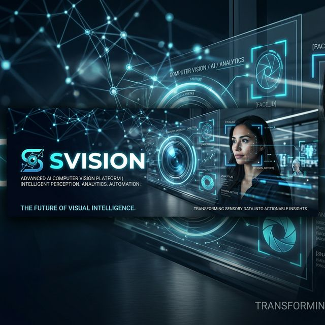
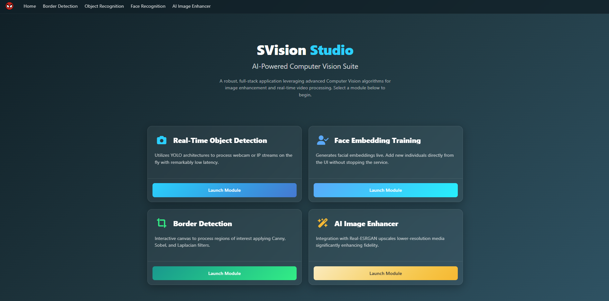
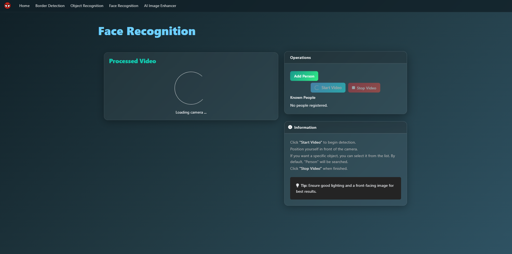
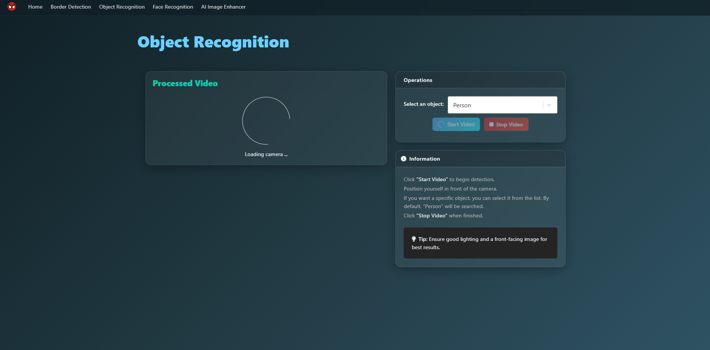
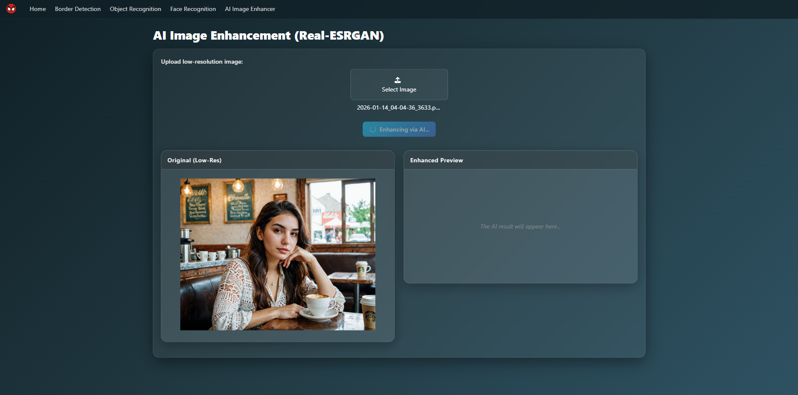

<div align="center">
  

  # SVision - AI-Powered Computer Vision Suite

  **A robust, full-stack application leveraging advanced Computer Vision algorithms for image and real-time video processing.**

  [](#)
  [](#)
  [](#)
  [](#)
  [](#)

</div>

---

## Overview

**SVision** bridges the gap between complex AI logic and user-friendly interfaces. Built with a React frontend and a microservice-oriented Python backend, this application empowers users to seamlessly process images and videos using state-of-the-art Computer Vision models. Whether it's enhancing image quality with Real-ESRGAN, detecting faces in real-time streams, or tracing complex borders instantly, SVision packages enterprise-grade AI into an accessible web platform.

## Key Features

- **Real-Time Video Object & Face Recognition:** Utilizes YOLO architectures to process webcam or IP streams on the fly with remarkably low latency.
- **Dynamic Face Embedding Training:** Add new individuals directly from the UI, generating and injecting facial embeddings live without stopping the service.
- **Image Edge & Border Detection:** Interactive canvas to process regions of interest (ROI) applying Canny, Sobel, and Laplacian filters.
- **AI Upscaling Engine:** Integration with Real-ESRGAN upscales lower-resolution media significantly enhancing fidelity.
- **Modern Glassmorphism UI:** A sleek, premium dark mode interface designed for optimal UX and responsiveness.

## Tech Stack

### Frontend
- **React 19 & Redux Toolkit** - State management and reactivity.
- **Bulma & Custom CSS** - Glassmorphism aesthetics and responsive grid.
- **React-Konva** - Interactive canvas manipulation for dynamic regions bounding marking.

### Backend (Python Microservices)
- **Flask** - REST APIs serving individual computer vision modules.
- **PyMongo** - Data persistence for face embeddings and metadata.
- **OpenCV & scikit-image** - Core frame capturing, encoding, and image processing.
  
### AI / Machine Learning
- **YOLOv8** - Pre-trained networks for high-speed object detection.
- **Keras FaceNet** - Precise extraction of 512-dimensional facial embeddings.
- **Real-ESRGAN** - Deep learning network for practical image restoration.

---

## Screenshots

| Dashboard & Home | Face Embedding Training | Real-Time Object Detection | AI Image Enhancer |
| :---: | :---: | :---: | :---: |
|  |  |  |  |

*(Note: Replace the screenshot placeholders above with actual images from the live project.)*

---

## Setup & Installation

### Prerequisites
- Node.js (v18+) and npm/yarn
- Python 3.9+
- MongoDB instance (local or Atlas)

### 1. Frontend Setup
```bash
cd svision_front
npm install
npm start
```

### 2. Backend Services Setup
The backend consists of decoupled AI services. To start a specific service (e.g., Face Recognition):
```bash
cd face_recognition
python -m venv venv
# On Windows: venv\Scripts\activate. On Unix: source venv/bin/activate
pip install -r requirements.txt
python realTimeDetection.py
```
*(Repeat the Python installation process for other modules like `video_object_recognition` or `image_modification`.)*

---
<div align="center">
  <i>Engineered with clean code principles, scalable design patterns, and an obsession for AI by a Senior Full Stack Engineer.</i>
</div>
